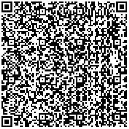
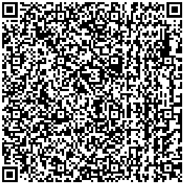
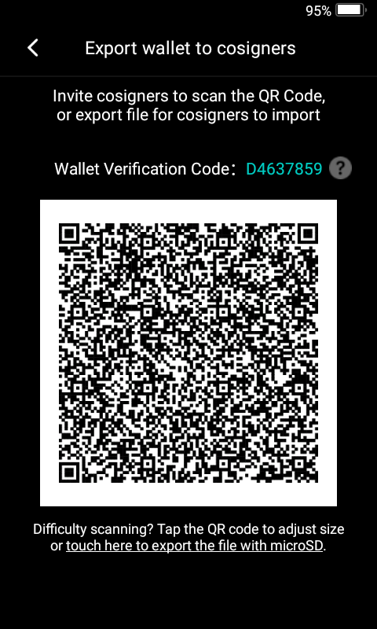

# Keystone Integration Guide
Keystone is an air-gapped, QR Code based hardware wallet. Keystone is a pure signer for your crypto transactions, Keystone don't have external wireless  connections like Bluetooth, WiFi, etc. The only way it can transmit data is via QR codes.
This guide is for developers who would like to integrate their services with Keystone.

### Animated QR Codes
With Keystone, we use QR Codes to transmit data, since each qr code image can only contain limited size of data, in order to send big chunks of data, we use animated QR codes to transmit big chunks of data. We are using the bc-ur to encode the data, for bc-ur please refer to [bc-ur](https://github.com/BlockchainCommons/Research/blob/master/papers/bcr-2020-005-ur.md). In the BTC-only firmware, we also use [ur-type]([https://github.com/BlockchainCommons/Research/blob/master/papers/bcr-2020-006-urtypes.md]) for different bitcoin related data usages.

We are using these libraries:
- JavaScript: 
    - ur-type encoding https://github.com/KeystoneHQ/ur-registry
    - bc-ur encoding https://github.com/Apocentre/bc-ur#readme
    
- Java
    - bc-ur and ur-type https://github.com/sparrowwallet/hummingbird

#### libraries
##### web
There are a lot of existing libraries which currently can be used to scan qr codes and here is some of it used by our friends :)
- [qr-scanner](https://github.com/nimiq/qr-scanner)
- [vue-qr-code](https://github.com/gruhn/vue-qrcode-reader/) 

##### React Native
 - [react-native-camera](https://github.com/react-native-camera/react-native-camera)
 
##### Native App
For IOS and Android App we can use their native libraries to scan QR Codes.
  
## BTC Only Firmware
We also provide a [BTC-only Firmware](https://github.com/KeystoneHQ/Keystone-cold-app-btc) for those who only use Bitcoin. You can get the latest firmware from [here](https://keyst.one/firmware), For Bitcoin, we follow the BIP174, aka PSBT to encode transactions. For those who are not familiar with BIP174 and PSBT, those can find here are some good reference guides:

- https://github.com/bitcoin/bips/blob/master/bip-0174.mediawiki
- https://bitcointechweekly.com/front/bip-174-psbt-partially-signed-bitcoin-transactions/
- https://en.bitcoin.it/wiki/BIP_0174

And we strictly follow the [slip-0132](https://github.com/satoshilabs/slips/blob/master/slip-0132.md) to encode the extended public key.
Coin                                      | Public Key            | Address Encoding                | BIP 32 Path |
------------------------------------------|-----------------------|---------------------------------|-------------|
[Bitcoin](https://bitcoin.org/)           | `0x0488b21e` - `xpub` |P2PKH or P2SH                    | m/44'/0'    |
Bitcoin                                   | `0x049d7cb2` - `ypub` |P2WPKH in P2SH                   | m/49'/0'    |
Bitcoin                                   | `0x04b24746` - `zpub` |P2WPKH                           | m/84'/0'    |
Bitcoin                                   | `0x0295b43f` - `Ypub` |Multi-signature P2WSH in P2SH    | m/48'/0'/0'/1'           |
Bitcoin                                   | `0x02aa7ed3` - `Zpub` |Multi-signature P2WSH            | m/48'/0'/0'/2'           |
Bitcoin Testnet                           | `0x043587cf` - `tpub` |P2PKH or P2SH                    | m/44'/1'    |
Bitcoin Testnet                           | `0x044a5262` - `upub` |P2WPKH in P2SH                   | m/49'/1'    |
Bitcoin Testnet                           | `0x045f1cf6` - `vpub` |P2WPKH                           | m/84'/1'    |
Bitcoin Testnet                           | `0x024289ef` - `Upub` |Multi-signature P2WSH in P2SH    | m/48'/1'/0'/1'           |
Bitcoin Testnet                           | `0x02575483` - `Vpub` |Multi-signature P2WSH            | m/48'/1'/0'/2'           |


### Single-Sig
Currently we have integrated with a lot of well-known wallets, like Electrum, Blue Wallet, Wasabi Wallet, BTCPay, Specter, Sparrow etc. and also we provide generic wallet models to other wallets or services who would like to integrate with us. 

#### Setup the watch-only wallet

Watch-only wallet import of the extended public key from Keystone, Keystone support both file and qrcode.
- QR code: we are using [crypto-account](https://github.com/BlockchainCommons/Research/blob/master/papers/bcr-2020-015-account.md) to describe the extended public keys. However, currently we only put one xpub selected by user into crypto-account for some product reason.  

- File: we are using [bitcoin output descriptor](https://github.com/bitcoin/bitcoin/blob/master/doc/descriptors.md) to describe extended public key.

**Raw Data**:
```
Extended Public Key:
xpub6C23Z5ywx3Ts5TauvBCsf6e1EstwJ2bMbgGQAQp98oftj6j2HgiWt3jEVvTMndkuE8V58Tcaj9E11kVcwbGCxf5UZpyxBvWKEjuRVRPKnaT
Path: M/44'/0'/0'
Script Type: `p2pkh`
```
**UR**:
```
ur:crypto-account/oeadcyemrewytyaolytaadmutaaddloxaxhdclaxadatgawpashssbrdfsmubshgntsbnniaktfyvtqdrsmdfhpajntbvytnispagdplaahdcxbaspkkfmfmdrhyfdlprlcshylsvebdfyoxjpueiettdijysnrhgulnbyoypdkemuamtaaddyoyadlncsdwykaeykaeykaycyjnnthelrlswzrpss
```

**QR**:


#### Sign PSBT
We use psbt to encode the unsigned transaction and we provide two ways for that:
1. File:The unsigned PSBT file should be encoded as binary or base64 encoding and should use the .psbt file extension. reference [bip174](https://github.com/bitcoin/bips/blob/master/bip-0174.mediawiki) here is the example unsigned psbt file [example](./unsigned_single_sig_psbt.psbt)

2. QRCode: We use [crypto-psbt](https://github.com/BlockchainCommons/Research/blob/master/papers/bcr-2020-006-urtypes.md#partially-signed-bitcoin-transaction-psbt-crypto-psbt) to encode the psbt data. Here is a sample QRCode Image. 


#### Export Signed PSBT

After signing, users can export the signed psbt, we provide two ways for that:

1. Signed psbt file: see the example signed psbt file [example](./signed_41262fb9.psbt)

2. QRCode: here is the sample qr code of signed PSBT. 


## Multi-Sig
We also support Multi-Sig for Bitcoin, currently we can use Keystone and ColdCard to set up Multi-Sig Wallet and perform multi-Sig, we have integrated with Electurm, Spector-Desktop, BlueWallet, Sparrow etc.

<!-- you can check this guide about how to use Keystone to perform multi-sig: https://btcguide.github.io/ -->

#### Setup Multi-sig wallet

Users can create a Multi-sig wallet by collecting all co-signers extended public key or import a multi-sig wallet file export from another Keystone co-signer.

1. Export the xpub of co-signer, it can be export via file or QR Code：

**Raw Data**:
```
ExtendedPublicKey: Zpub6vZyhw1ShkEwNBUvpwXnR6u9tSdkeNY7LpS9xqZy2g3Yq3wwbNaDNeiB2nrj17sB2NsBYeqCiQFBEWf5x5WjshDepfXjFDmgCnoT3ayhm5u
Path: M/48'/0'/0'/2'
xfp: 37b5eed4
script Type: P2WSH
```
**UR**：
```
 ur:crypto-account/oeadcyemrewytyaolytaadmetaaddloxaxhdclaohnhffmvsbndslrfgclpfjejyatbdpebacnzokotofxntaoemvskpaowmryfnotfgaahdcxdlnbvecentssfsssgylnhkrstoytecrdlyadrekirfaybglahltalsrfcaeerobwamtaaddyoyadlocsdyykaeykaeykaoykaycyhkrpnddrckvoonsa
```
**QR**:



2. Import Multi-sig wallet, Multi-sig wallet data format

These data can be exported via fil or QR Code, here is a sample file:

```
# Keystone Multisig setup file (created on 5271C071)
#
Name: CC-2-of-3
Policy: 2 of 3
Derivation: m/48'/0'/0'/2'
Format: P2WSH

748CC6AA: Zpub75fLJ4Y3UMxgoL2N6XLecqLj2Gt6JJ6U5t48PwB6bTEnWUgkhG3vavhnh8ZZwj3mA9acN7gU1NaqNXzvZyTKJrZLK7q7JqcamdoFhpgtizf
C2202A77: Zpub75H51BQ73jcN2d8VcnScwnwKwrfRsA7UXL1LHmoxmXmGmFgCwxs4raek66GYG5sBdqnyS7whyR4c36Ky4x7Rfo7sVkfS7hvJNEUtX6LexH2
5271C071: Zpub755NbzNDFus6egJM22CLBqjabHyNV8PEWJHGBkfCSXN2W8HRPKEA2MyxvycgD4AxNMcrTuxSwKYiNJ19h9PLURGZoWyC2Tutr7SWaU1swYK
```

- Name: the multi-sig wallet name
- Policy: multi-sig policy like 2 of 2 , 2 of 3
- Derivation: the Derivation path of all the extend public key for multi-sig
- Format: your script format, current we support P2WSH, P2WSH-P2SH, P2SH (P2SH-P2MS)

the following items are master fingerprint and its extended public key
- {master fingerprint:extended public key}

The data format should be consistent with the file and all the fields should be filled.

**QR**: 

We use bc-ur to encode this sample file and here is an sample data:

```
    UR:BYTES/HKADWYCNCXGRIHKKJKJYJLJTIHCXGTKPJZJYINJKINIOCXJKIHJYKPJOCXIYINJZIHCXDEIAJPIHHSJYIHIECXJLJTCXECEYEMEHFXDYEMEHDTBKCNBKGLHSJNIHFTCXFXFXDPEYDPJLIYDPEOBKGDJLJZINIAKKFTCXEYCXJLIYCXEOBKFYIHJPINKOHSJYINJLJTFTCXJNDLEEETDIDLDYDIDLDYDIDLEYDIBKFGJLJPJNHSJYFTCXGDEYHGGUFDBKBKEMEEETFXFXENFPFPFTCXHTJOKPIDEMECIYGSGEEEHKEOGOGTKSIOJLGSEYGLENHDGSIHIAJSGSIMEYFLJYENGEGEENGOECJYEEETGDKTFWENIDGHFEJTHGGOIOJEISFLEOKOHSKOISJTISETHTHTKTIMEOJNFPESHSIAGLEMIOGOEHGLHSJSGLHDKNKOHTKKGHGRGEJPHTGSGREMJSEMGEJSIAHSJNIEJLFGISJOIOJYINKNIYBKFXEYEYDYEYFPEMEMFTCXHTJOKPIDEMECFDECEHFWGYEMEOIMIAGLEYIEETHFIAJTGUIAKTJTKTGRKTJPIYGMJKFPEMGOHDGSEHGSFDJNJLKSJNHDJNFLJNFGIOFXKTKSJKEEJPHSIHJEENENFLHKFLECJKFWIEJSJTKKGUEMKTISKKGMEEIAEOENGRKKEEKSEMGMIYJLEMJKHFJEIYGUEMISKOGEGLFEGOJYHDENGSIHKSFDEYBKECEYEMEHFXDYEMEHFTCXHTJOKPIDEMECECGLIDKNGLFYFGKPJKENIHIOGEGTEYEYFXGSFWJSIMHSIDFDKKGLHFETGDFEHGGEFDFLFWJEIYFXGUHDGLEYHGETFDGMGDGRFEFPEYGTKKKSKOKKIAIOFYEEFPKSGLGTIAJPGHKPKSGUKTGRHKINGLGEEHESISESGDGSGOGMFLHTJLHGKKFXEYGHKPJYJPEMGUHGHSGOEHJKKTHKGRBKHHIOCNOS
```

And here is the sample image: 




#### Sign PSBT

For multi-sig, unsigned and signed PSBT are consistent with single-sig and we also provide two ways for it.

Unsigned psbt file:

See the example unsigned multisig psbt file [example](./unsigned_multisig_psbt.psbt)

Unsigned psbt Qrcode(encoded in bc-ur):


#### Export Signed PSBT

Signed multisig psbt file:

See the example partially signed multisig psbt file [example](./part_f6a35290_5271C071.psbt)

Signed multisig psbt qrcode(encoded in bc-ur):


### FAQ

TBD