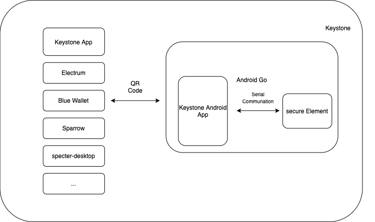

# Keystone Developer hub

**The Keystone hardware wallet is simply relaunched from the Cobo Vault branding so both the code base and infrastructure are almost the same. For more info please checkout [here](https://blog.keyst.one/leaving-cobo-to-continue-the-cobo-vault-legacy-29bb2f8f026e)**


Keystone is an air-gapped, open source hardware wallet that uses completely transparent QR code data transmissions. Visit the Keystone official [website](https://keyst.one) to learn more.

## High Level Architecture
Keystone is built on a specialized security hardware platform with a Secure Element that currently runs on a highly secure and enhanced Android Go platform.



The user's senstive data like private keys, master seed, entropy are stored on the secure element.The Secure Element communicates with the hardware wallet application layer through a serial communication protocol. Users need to set a password before using Keystone, which can be used to unlock the device, sign transactions, or do other sensitive operations.

We use QR code data transmissions to air-gap. For details on the data protocol we use, please check [here](https://github.com/KeystoneHQ/crypto-coin-message-protocol)

current we are using the bc-ur for encoding data. for more info about the bc-ur, please check out the [Blockchain Common Docs](https://github.com/BlockchainCommons/Research/blob/master/papers/bcr-2020-005-ur.md)


```
UR:BYTES/HDTYCTLUAYAEAEAEAEAEAEAEVLHNBBVOYLGLPMDWDMSOTKGRGODEDWGETOGWGAMDNYSRSPSEDESSHSIMIEJTVSJZHNJTDETLSBSPTLSKSPSKWPBBVODWRTDETLRTSPSKWEPYJLIDPTPLJLAEFWFWYTBZAHONGAIYDMSWNLDSIYMEDSSWSEJTINHKPLGLMECFPTGLUESWGADAMERNFPRHMTTOINGACMCLDADSRNOLGLIHLNIYDAMNFEKBGLVWOLMNCLKBMDHYVYHKDTSORNMDFMBZYTTODTCKVYCLIHRHSWLDTAVAHKFGGLVYLDSOLPOLFMVWDSVACMLDMEOYPTMNFPYTMERHDSDTIHLDLYWLHYGLMNWYSKGABGLKCYBWZCLKLRVTGLKODPDMGLSNDNSOGSSFADAEJYLDJLCXSOAEAEAEASYTSKAS
```

we are working an demo of the animated QRCodes. once finished we will open it on our Github.

## Integration
Please check this folder for intergation: [Integration](./integration/index.md)

## Hardware docs
[hardware](./hardware): check the `hardware` folders for our hardware documents. Currently our schematic and BOM files are open source.

## Application docs
[applications](./application): check the `application` folders to see our applications documents.

## Secure Element docs
[se](./se): check the `se` folders to see our secure element documents.

## Audit-report docs
The Keystone hardware wallet is simply relaunched from the Cobo Vault branding so both the code base and infrastructure are the same. For more information, Please see the Audit Report by PeckShield from mid 2020.

[audit-report](./audit-report): check the `audit-report` folders for audit report documents.

## Don't Trust, Verify!
`Don't Trust Verify`. Check our documentation to learn about how you can verify our firmware.
- [Verify Application](./application/Keystone_Application_Update_Package_Verification.md)
- [Verify Secure Element](./se/Keystone_SE_Firmware_Update_Package_Verification.md)


## FAQ
1. How to decode the QRCode and verify the data in the QRCode ？ 

    For multi-coin firmware, we are using the proto-buffer to encode the transaction data or sync data. Really thanks @fnord123 build an great tool to others to decode the QRCodes.
    For details, please check out this repo: https://github.com/KeystoneHQ/KeystoneQRVerifier
