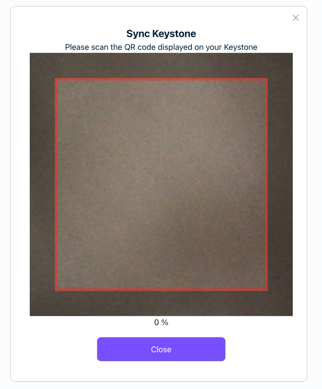

# Keystone Arweave Mode Integration Guide

The goal of the Keystone hardware wallet is to provide users with a reliable and quality signer by protecting users'
private keys so Keystone seeks to integrate with existing wallets and applications.

We have drafted a QR Code data transmission, Here is the
link [QRCODE](https://github.com/KeystoneHQ/Keystone-developer-hub/blob/main/research/arweave-qr-data-protocol.md).

## Firmware Requirement

You need Keystone Multi-coin Firmware support Arweave for the integration. Find it
from [here](https://keyst.one/firmware?locale=en).

## Wallet Integration

In order to work with Keystone, a wallet can follow the process:

1. Keystone provides the public key information to the wallet via QR code, to generate Arweave address.
2. The wallet generates the unsigned transactions, sends it to Keystone to sign via QR Code.
3. Keystone would then sign the data and provide a signature back to the wallet via
   QR Code.
4. The wallet receives the signature, constructs the signed data (transaction), and performs the
   following activities like broadcasting the transaction, etc.

## Library

[`@keystonehq/bc-ur-registry-arweave`](https://www.npmjs.com/package/@keystonehq/bc-ur-registry-arweave)

[`@keystonehq/animated-qr`](https://www.npmjs.com/package/@keystonehq/animated-qr)

[`@keystonehq/arweave-keyring`](https://www.npmjs.com/package/@keystonehq/arweave-keyring)

## Example

With the help of `@keystone/arweave-keyring`, wallets can easily integrate with Keystone without caring too much about
UR.
`@keystone/arweave-keyring` encapsulates the details like encode/decode UR, construct UR from data etc. wallets only
need care about the UX like `display the qr code` or `render the camera to scan the QR`
code.

`@keystone/arweave-keyring` uses `InteactionProvider` to handle the UI interaction, it uses `@keystone/sdk`
as the interaction provider by default, the integration is very straightforward.

### Connect Keystone

```ts
import {DefaultKeyring} from '@keystonehq/arweave-keyring';

const connectWallet = aysnc()=>{
...
    // Init a keyring instance 
    const keyring = DefaultKeyring.getEmptyKeyring();

    // This will call the video camera.
    // by scanning the QR code displayed in Keystone HardWare Wallet, The keyring will be initalized with public key inforamtion.
    await keyring.readKeyring();
    console.log(keyring.getKeyData().toString('hex'));  //c41a50ed2155a5740b45df8e3815774d6b8d193e5ad80c9efaaf6d6d0253f350c85becf39eb7056d75841f6a064acf8381383eceb218e16859ef72be7273321a2b4855b87bc6f14c734e2a9c90850c34a8a0a4279ac9be3186b086db5b302fb68176b4c1fee337456c42f972c7993f618fdedc0bf1658c2d59cf2c0c6ac31a61ac1260e0fd4a761ca3707e27611c14b4c6b6abe698c11009ddf5d1511ae47ea271079b6892d229a27d0822e0c7aa12a4cf7f7c28fe23d201eae2adb7f403c9c5a1762c2d8cc96898ce41fe529ab0ef8184e50063e6fc62e0a808e8602254c142c9e7f7e94e6ef2c767ac0e99810d09a44bfde8db46298bc0e25b4a333b4ef86cd7ce658ff661ab0d1789b603b8770a6b433851a91c8ff07a7a8a0767702f6887098ea34bf4a8309eaab9baadd16d45cdd9b1899b6a303a2dce23745cec9fc2ecd9735a66c77fdea1bfd4cdb2be7bfb407a4fd5d3405c3cb33b5316e16559f0c4bf0bc7d1a3ada78917217b289c4d75eb60e0396f03035fd8d553727c790189cfd8dabcee8a4ae6607925b9a27ff7ad7ede26b98f8acd2532cf3175693f3eede9989a0aeedbdb3ff14fec823017531aead4cd22733ab30dbce76cebcdac64424128d6eeff3cdc1825d7cdb7113e74db126e6d931544467c6979aa8d50ac803f36084ed7077f34acfcf3f77bb13d5ebb723fc5d3f45212d2dd6ef20ea757fb4c95
...
}

```



### Sign Transaction

```ts
// In your Transfer component, call the `keyring.signTransaction`.
// It will render the `arweave-sign-request` UR, 
// This promised will be resolved by scanning the `arweave-signature` UR generated from Keystone HardWare Wallet.
const signature = await keyring.signTransaction(signData,32);
console.log(signature.toString('hex')); // a8e58c9aa9a74039f239f49adca18ea5d54b9d28852b7d39b098a96230ebe4b07bf1f66eea2ef3ee29ab912f90508917703ca9838f228b0f75014ea5d41101f7dff194d8086010aa92b6e6d04a56ed6cb7bd63c3dc15f833c0fcbeb03a16892ed715f7b178c20dbb6cd9923ddd0ab4b1c8753a554a8165ff34224fb630445582d3b588581deca41dbcf2144dcf10a362510178af9923e9f6cdf30dfaafa5642a20f777a4a9bff7170517d9a4347a2f0e360a38bf90a8b5d10f80f2581422798aa7b77d959f237a77d71b35558349e35f9c1193154bcf252d79171abeec6f37858584f878503af44a3553eb218b86dc31dfcca66dea947364580515bb2543d2403d53866ee16bba1b8e51ba060a5ecfef3ef4617d96fa3a3f67176621e638ad7e33bf08c56409f0ce01ef345ac4b49ba4fd94dbaf11b544f4ce089d9adcebf5b592afd2f8cecf22f21539975e50441fe3bf5f77d7d0fcfa2bd3c6e2cbf1bb59ed141b5c0f257be5958c5b46c9f08ec1e912b7fa6ff7182aa9010ce9f0cd6fc4845760a37f97197ea8ad3fa8a75b742e9ad61f877acd5771e7c43e0c75a422eb7d96153d4c561469c0f6011d0fe74f718b2db26894e3c5daf72784d34374c4dab78c3ff7619f883085a45efe1781cfcdb80b64b4c8aa96f86225144ca9430a499e96c607a77538ad7fb920fdd1126cdc8c5574ed3c2b1fb1dadac51ad4e13fdd9d
```


## Customize the interaction provider

you can define your own interaction provider to customize ux by implementing the `InteractionProvider` interface.

```ts
export interface InteractionProvider {
    readArweaveCryptoAccount: () => Promise<ArweaveCryptoAccount>;
    requestSignature: (signRequest: ArweaveSignRequest) => Promise<ArweaveSignature>;
}
```

Here is an example
of [MetaMask Interaction Provider](https://github.com/KeystoneHQ/keystone-airgaped-base/blob/master/packages/metamask-airgapped-keyring/src/MetaMaskInteractionProvider.ts)
.

By defining your own interaction provider, wallets can customize the `UI Components` by subscribing to the specific
event
emitted by the interaction provider.

### Define your own interaction provider

```ts
export class WalletInteractionProvider extends EventEmitter implements InteractionProvider {
    static instance: WalletInteractionProvider;

    constructor() {
        super();
        if (WalletInteractionProvider.instance) {
            return WalletInteractionProvider.instance;
        }
        WalletInteractionProvider.instance = this;
    }

...
    requestSignature = (signRequest: ArweaveSignRequest) => {
        return new Promise((resolve, reject) => {
            const ur = signRequest.toUR();
            const requestIdBuffer = signRequest.getRequestId();
            const requestId = uuid.stringify(requestIdBuffer);
            const signPayload = {
                requestId,
                payload: {
                    type: ur.type,
                    cbor: ur.cbor.toString("hex"),
                }
            };
            this.emit('signRequest', requestPayload);
            this.once(`${requestId}-signed`, (cbor: string) => {
                const signature = ArweaveSignature.fromCBOR(Buffer.from(cbor, "hex"));
                resolve(signature);
            });
        });
    };
...
}
```

### Keyring with customized interaction provider

```ts
export class WalletKeyring extends BaseKeyring {
    getInteraction = (): WalletInteractionProvider => {
        return new WalletInteractionProvider();
    };
}
```

### UI Component

```tsx
// '@keystonehq/animated-qr' makes the handle of multiple QR codes much easier.
import {AnimatedQRCode} from '@keystonehq/animated-qr';

export default class ConfirmKeystoneTransaction extends Component {
    constructor(props) {
        super(props);
        this.state = {
            signRequest: null
        }
        this.props.wallet.keyring.getEventEmitter().on('signRequest', (signRequest) => {
            this.setState(() => ({
                signRequest
            }));
        });
    }
    return <AnimatedQRCode cbor={signRequest?.cbor} type={'arweave-sign-request'} options={{ size: isSmallView ? 300 : 400 }} />
    
}

```
