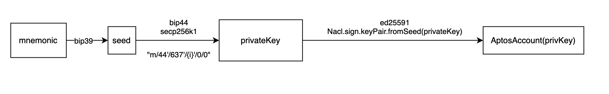
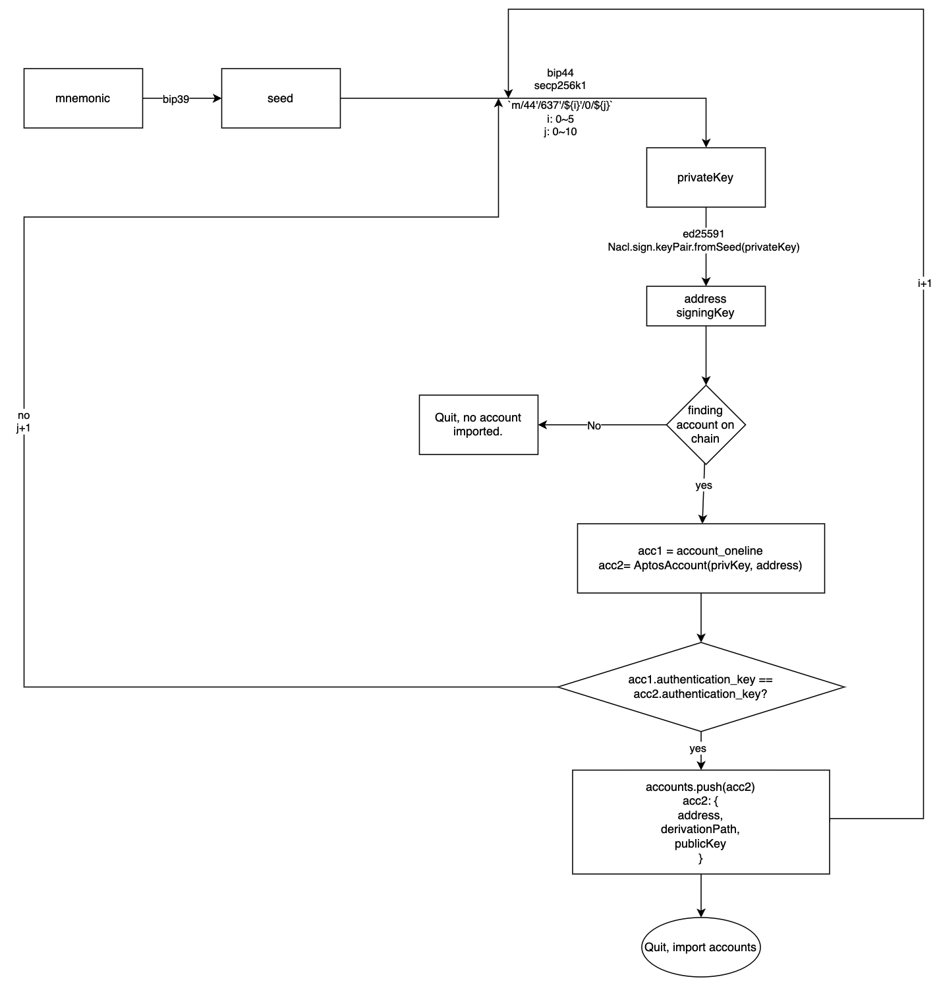

# Martian Integration Discussion

The goal of the Keystone hardware wallet is to provide users with a reliable and quality signer by protecting users' private keys so Keystone seeks to integrate with existing wallets and applications.
Regarding the integration process, there are two main processes:
1. Sync Keystone Account to Martian.
2. Support Signing Transactions with Keystone hardware wallet in Martian.

## Background about Aptos Account and Authentication Key
In Aptos blockchain, when creating a new account, a 32-byte authentication key will be created first, this authentication key will be the account address, the authentication key will change
when generate a new pair of private and public key to rotate the authentication key, but the account address will not change.

In my understanding, currently in Martian, new account can be created in the following steps:

- Step 1: Generate 12 mnemonic words.
- Step 2: Follow [bip39](https://github.com/bitcoin/bips/blob/master/bip-0039.mediawiki) to generate seed.
- Step 3: Follow [bip44](https://github.com/bitcoin/bips/blob/master/bip-0044.mediawiki) to derive a secp256k1 privateKey for path `"m/44'/637'/0'/0/0"`.
- Step 4: Create a new Aptos account, an ed25519 signing key pair will be generated for this account, the private key generated in `Step 3` will be used as the private key of the signing key pair, the `sha256(public key | signing schema)` will be the account's authentication key.  

Up to five accounts can be created in Martian by increasing the `account level` bip32 path.

### Questions

1. Why we derive privateKey with secp256k1 and ed25519, are there any reasons about not using only `ed25519` since it's the Aptos blockchains is using [ed25519](https://ed25519.cr.yp.to/)?

Users can also rotate account's authentication key in Martian:

- Step 1: Generate a `newDerivationPath` by increasing the `index level` of the account's authentication key's derivation path.
- Step 2: Follow [bip32](https://github.com/bitcoin/bips/blob/master/bip-0032.mediawiki) to derive a secp256k1 privateKey of the `newDerivationPath`.
- Step 3: Using the privateKey generated in `Step 2` as private key of the ed25519 signing key pair, the `sha256(publicKey| signing schema)` will be the new authentication key.

One account can rotate authentication key up to 10 times.

### Questions

1. The current `authentication key rotation functionality` is pretty cool, it not only secures user's account when the authentication key is compromised, but also prevent users from randomly generate a new authentication key, makes the account hard to recover later.
   In order to sync the Keystone account to Martian, we need to make an agreement on:
   1. How the account's address will be generated, using the current Marian address generation process or the pure ed25519 address generation, or some better solutions?
   2. Which derivation path will be used when generate account's address ?
   3. How many accounts can be imported ?
   4. Which derivation path will be used when rotate account's authentication key?
   5. How many times an account can rotate its authentication key ?

   For all the decisions we made, I think it would be better to co-author an [aip](https://github.com/aptos-labs/aip) proposal to standardize the address generation and authentication key rotation process, so users can manage
their Aptos' account cross different wallets seamlessly.

In my understanding, currently Martian `Import Wallet` works as follows:

- Step 1: Import 12 mnemonic words.
- Step 2: Generate the account with the same derivation logic as `Create Wallet`.
- Step 3: Increase the `index level` bip32 path for each account since account signing key might be [rotated](https://aptos.dev/guides/guide-for-system-integrators/#rotating-the-keys).

Up to 10 `index level` will be checked.

### Questions

1. Currently, when `Import Wallet` in Martian, If the account does not exist in Aptos blockchain, the import process will fail and no account will be imported, which means it is impossible for a Keystone user to
   import their newly created account into Martian.
