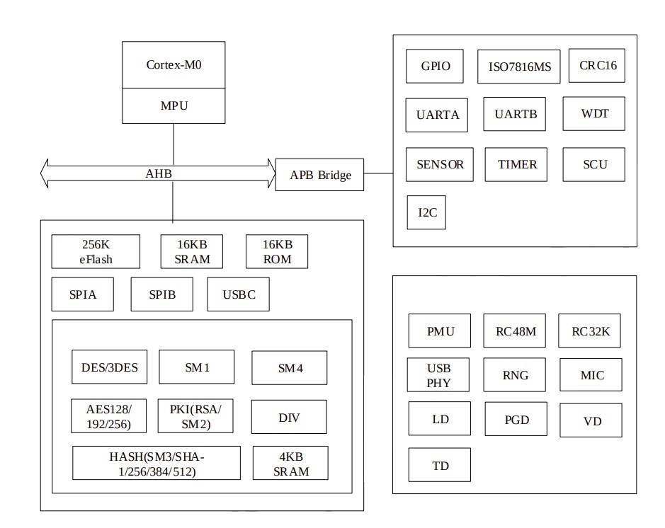
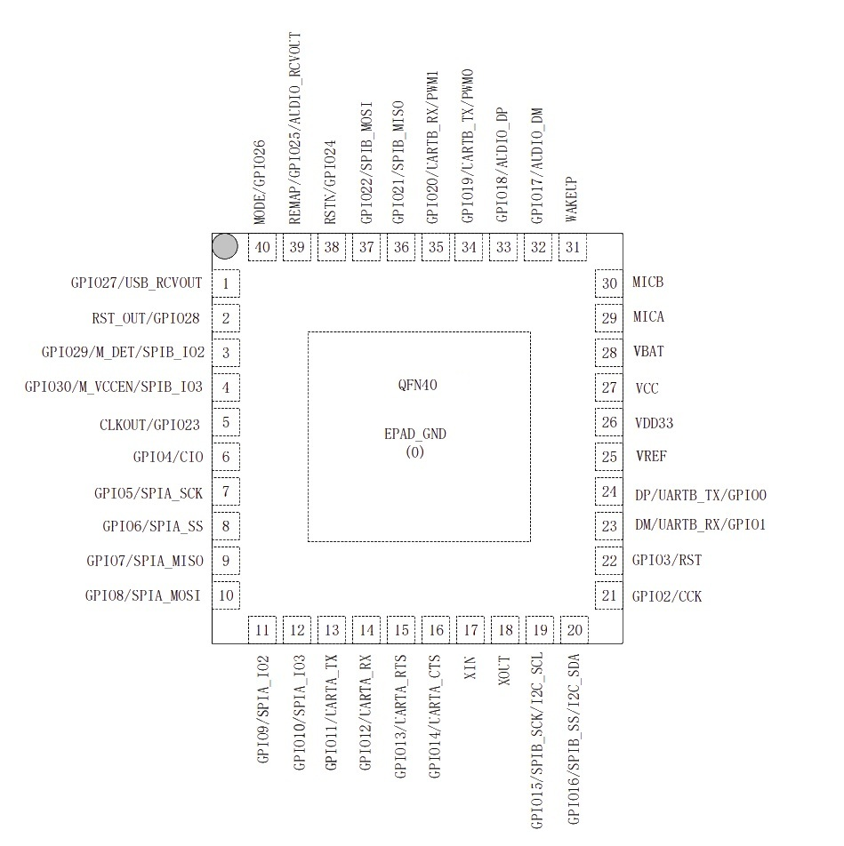
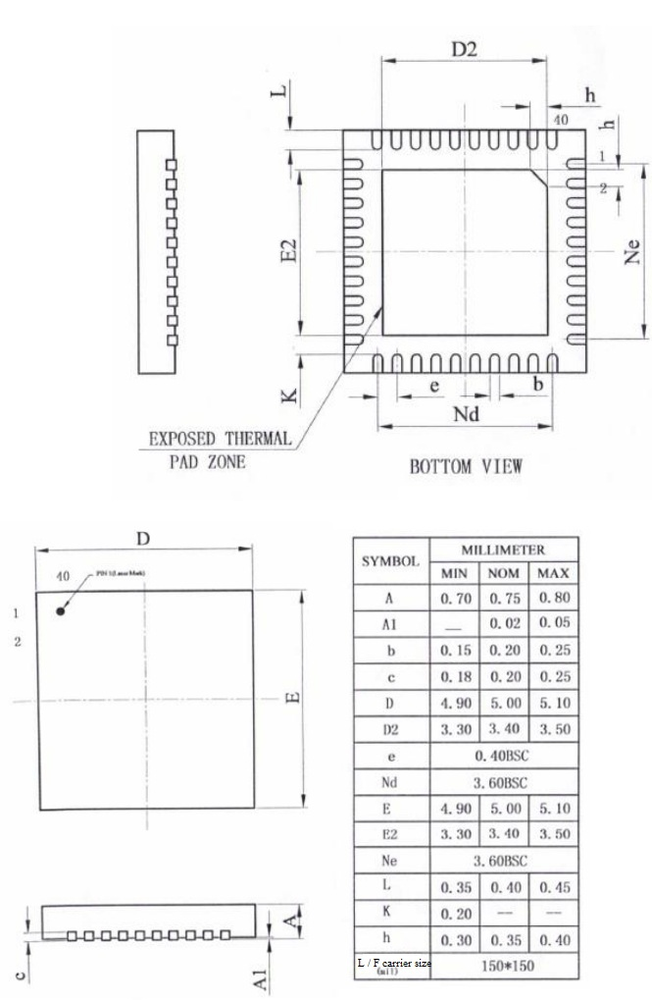

# Keystone Secure Element Datasheet

## 1. Abstract

Low power 32-bit SoC security microcontroller, 256KB flash, 16KB SRAM, USB2.0 full speed, ISO7816, SPI, UART, I2C, PWM, TIMER, TRNG, DES/TDES, SM1, SM4, AES128/192/256, RSA4096, SM2/ECC, SM3/SHA1/256/384/512.

## 2. Features

### 2.1. Processor

- 32-bit ARM Cortex-M0
- Clock frequency up to 48MHz
- Three-stage pipeline, Thumb/Thumb-2 instruction set
- NVIC interrupt controller
- SysTick timer

### 2.2. Memory

- 16KB ROM
- 16KB + 4KB SRAM
- Capacity: 256KB
- Page size: 512B
- Data bit width: 32bits
- Page erasing time: 2ms
- Word programming time: 30us
- Max number of page erasures: 100,000 times
- Data retention time: 10 years

### 2.3. Timer

- Three 32-bit decreasing/increasing timers
- Timer 0/1 can be configured as input capture and PWM with the output compare module
- 32-bit watchdog timer

### 2.4. Cryptographic Algorithms

- Symmetric algorithms: DES/3DES, SM1, AES, SM4
- Asymmetric algorithms: RSA, ECC Prime/Binary Field, SM2
- Digest algorithms: SM3, SHA-1/256/384/512
- Random number generator: HRNG (FIPS 140-2 compliant)
- CRC16-CCITT verification unit

### 2.5. Peripheral Logic Circuit and Clock

- Built-in 48MHz and 32KHz RC oscillator, can be connected with external 12M crystal oscillator (QFN40)
- USB ports: USB2.0 full speed, 1 control port and 4 bidirectional bulk ports, supports crystal-free mode
- ISO7816: supports master/slave mode, ISO7816-3 protocol, Smart Card Protocol T0/T1
- SPI: two-channel SPI interface, selectable master/slave mode, supports the mode 0/1/2/3 transmission protocol, supports SPI 1/2/4 line transmission
- 31 GPIO (multiplex included), supports edge/level triggered interrupt
- UART: two-channel RS232 serial ports, one channel supports CTS/RTS
- I2C: master/slave interface, supports standard/fast/HS three speed modes, supports 7bit device address
- Battery Monitor: range 2.5-4.4V, accuracy 10mV
- Comparator: comparison accuracy 10mV, hysteresis interval 10mV
- Audio interface: supports MIC/GND adaption

### 2.6. Security Features

- Memory protection unit (MPU)
- Voltage/frequency/temperature/photosensitive detection function
- Power glitch detection
- External clock glitch detection
- Active metal shield
- Bus encryption crosstalk, memory check function
- 128-bit unique chip serial number

### 2.7. Electrical Parameters

- ESD protection: 4KV (HBM)
- Operating voltage: 2.7V ~ 5.5V (USB requires more than 3V)
- Operating temperature: -40~85°C
- Power:
  - Typical current 5mA@48Mhz, 10mA@48Mhz (PKI ON)
  - StandBy current 120uA
  - PowerOff current 1uA (battery)

### 2.8. Package

- QFN40

### 2.9. Development 

- ROM boot，support USB/SPI/7816 Download
- JTAG-SWD debug/download interface (EVB only)
- Evaluation board/release development kit
- ARM Keil MDK (4.0+)

## 3. Description

Keystone's Secure Element is a 32-bit security microcontroller, which is specifically targeted at low-cost and low-power fields. The Secure Element is an ARM Cortex M0 microcontroller integrated with a variety of secure cryptographic modules, including the SM1, SM2, SM3, SM4 algorithm, as well as RSA/ECC, DES/3DES, AES128, AES192/256, SHA1/256, SHA384/512 and other internationally recognized security algorithms. It supports true random number generation (TNRG). The Secure Element provides a variety of peripheral interfaces: USB2.0 full speed, SPI, UART, ISO7816, I2C, etc. built-in ROSC, and also supports crystal-free applications.  

Keystone's Secure Element has a 256K byte on-chip eFlash, 16K bytes of ROM, 16K bytes of on-chip SRAM, and 4K bytes of dedicated SRAM algorithm, of which on-chip ROM provides various algorithm interface programs for developers. It improves the development efficiency and optimizes system performance.

## 4. Performance

| Module                            | algorithm                                   | performance (System 48MHz, algorithm 48Mhz) |
| --------------------------------- | ------------------------------------------- | ------------------------------------------ |
| PKI                               | 1024-bit RSA key generation speed (CRT)      | 305.9 ms                             |
|                                   | 2048-bit RSA key generation speed (CRT)      | 2.3 s                                |
|                                   | 4096-bit RSA key generation speed (CRT)      | 26.2 s                               |
|                                   | 1024-bit RSA algorithm signature speed (CRT) | 9.36 ms                              |
|                                   | 2048-bit RSA algorithm signature speed (CRT) | 46.6 ms                              |
|                                   | 4096-bit RSA algorithm signature speed (CRT) | 286.5 ms                             |
|                                   | 192 bit (prime field) dot multiply          | 4.5 ms                               |
|                                   | 256 bit (prime field) dot multiply          | 7.4 ms                               |
|                                   | 384 bit (prime field) dot multiply          | 19.3 ms                              |
|                                   | 521 bit (prime field) dot multiply          | 45.2 ms                              |
|                                   | 113 bit (binary field) dot multiply         | 0.36 ms                              |
|                                   | 239 bit (binary field) dot multiply         | 1.0 ms                               |
|                                   | 571 bit (binary field) dot multiply         | 6.6 ms                               |
|                                   | SM2 Signature speed                         | 8.3 ms                               |
|                                   | SM2 Signature verification speed            | 15.8 ms                              |
| Symmetric cryptographic algorithm | SM1 encryption (decryption)                 | 32.5Mbps                             |
|                                   | SM4 encryption (decryption)                 | 32.5Mbps                             |
|                                   | DES encryption (decryption)                 | 25.6Mbps                             |
|                                   | AES encryption (decryption)                 | 30.2Mbps                             |

## 5. Functional Block Diagram

## 6. Package

### 6.1. Package Pin Layout

### 6.2. Pin Description

| Pin Function         |               |               | Package pin number |      | IO  Type | Reset status |       | Function Description                                         |
| -------------------- | ------------- | ------------- | ------------------ | ---- | -------- | ------------ | ----- | ------------------------------------------------------------ |
| Function 1 (Default) | Function 2    | Function 3    | QFN40              | TBD  |          | DIR          | PU PD |                                                              |
| DP                   | UARTB_TX      | GPIO0         | 24                 |      | I/O      | AZ           | -     | <li>USB differential signal D +</li><li>UARTB TX signal</li><li>GPIO0</li> |
| DM                   | UARTB_RX      | GPIO1         | 23                 |      | I/O      | AZ           | -     | <li>USB differential signal D -</li><li>UARTB RX signal</li><li>GPIO1</li> |
| GPIO2                | CCK           | -             | 21                 |      | I/O      | DI           | PU    | <li>GPIO2</li><li>ISO7816MS master-slave CCK</li>            |
| GPIO3                | RST           | -             | 22                 |      | I/O      | DI           | PU    | <li>GPIO3</li><li>ISO7816MS master-slave RST</li>            |
| GPIO4                | CIO           | -             | 6                  |      | I/O      | DI           | PU    | <li>GPIO4</li><li>ISO7816MS master-slave CIO</li>            |
| GPIO5                | SPIA_SCK      | -             | 7                  |      | I/O      | DI           | PU    | <li>GPIO5</li><li>SPIA clock signal</li>                     |
| GPIO6                | SPIA_SS       | -             | 8                  |      | I/O      | DI           | PU    | <li>GPIO6</li><li>chip select signal</li>                    |
| GPIO7                | SPIA_MISO     | -             | 9                  |      | I/O      | DI           | PU    | <li>GPIO7</li><li>SPIA IO1 (MISO) signal</li>                 |
| GPIO8                | SPIA_MOSI     | -             | 10                 |      | I/O      | DI           | PU    | <li>GPIO8</li><li>SPIA IO0 (MOSI) signal</li>                 |
| GPIO9                | SPIA_IO2      | -             | 11                 |      | I/O      | DI           | PU    | <li>GPIO9</li><li>SPIA IO2 (WP) signal</li>                   |
| GPIO10               | SPIA_IO3      | -             | 12                 |      | I/O      | DI           | PU    | <li>GPIO10</li><li>SPIA IO3 (HOLD) signal</li>                |
| GPIO11               | UARTA_TX      | -             | 13                 |      | I/O      | DI           | PU    | <li>GPIO11</li><li>UARTA TX signal</li>                      |
| GPIO12               | UARTA_RX      | -             | 14                 |      | I/O      | DI           | PU    | <li>GPIO12</li><li>UARTA RX signal</li>                      |
| GPIO13               | UARTA_RTS     | -             | 15                 |      | I/O      | DI           | PU    | <li>GPIO13</li><li>UARTA RTS signal</li>                     |
| GPIO14               | UARTA_CTS     | -             | 16                 |      | I/O      | DI           | PU    | <li>GPIO14</li><li>UARTA CTS signal</li>                     |
| GPIO15               | SPIB_SCK      | I2C_SCL       | 19                 |      | I/O      | DI           | PU    | <li>GPIO15</li><li>SPIB clock signal</li><li>I2C SCL signal</li> |
| GPIO16               | SPIB_SS       | I2C_SDA       | 20                 |      | I/O      | DI           | PU    | <li>GPIO16</li><li>SPIB chip select signal</li><li>I2C SDA signal</li> |
| GPIO17               | AUDIO_DM      | -             | 32                 |      | I/O      | DI           | PU    | <li>GPIO17</li><li>AUDIO Comparator input DM (Automatically turn off the pull-up resistor)*1</li> |
| GPIO18               | AUDIO_DP      | -             | 33                 |      | I/O      | DI           | PU    | <li>GPIO18</li><li>AUDIO Comparator input DP (Automatically turn off the pull-up resistor)*1</li> |
| GPIO19               | UARTB_TX      | PWM0          | 34                 |      | I/O      | DI           | PU    | <li>GPIO19</li><li>UARTB TX signal</li><li>Timer0 IC/PWM channel</li> |
| GPIO20               | UARTB_RX      | PWM1          | 35                 |      | I/O      | DI           | PU    | <li>GPIO20</li><li>UARTB RX signal</li><li>Timer1 IC/PWM channel</li> |
| SWDIO                | GPIO21        | SPIB_MISO     | 36                 |      | I/O      | DI           | PU    | <li>GPIO21</li><li>SWDIO (only applicable to the development version, this feature is reserved for the production version)</li><li>SPIB IO1 (MISO) signal</li> |
| SWCLK                | GPIO22        | SPIB_MOSI     | 37                 |      | I/O      | DI           | PU    | <li>GPIO22</li><li>SWCLK (only applicable to the development version, this feature is reserved for the production version)</li><li>SPIB IO0 (MOSI) signal</li> |
| CLKOUT               | GPIO23        | -             | 5                  |      | I/O      | DO           | PU    | <li>Chip system clock output</li><li>GPIO23</li>             |
| RSTN                 | GPIO24        | -             | 38                 |      | I/O      | DI           | PU    | <li>Chip reset input</li><li>GPIO24 (recommended output)</li> |
| REMAP                | GPIO25        | AUDIO_RCV OUT | 39                 |      | I/O      | DO           | PU    | <li>Chip start mode output</li><li>GPIO25 (supports low level Standby wakeup)</li><li>AUDIO_RCV comparator output</li> |
| MODE                 | GPIO26        | -             | 40                 |      | I/O      | DI           | PU    | <li>Chip startup mode (resets latch, suitable for Boot programs)</li><li>GPIO26 (recommended output)</li> |
| GPIO27               | USB_RCVO UT - | -             | 1                  |      | I/O      | DI           | PU    | <li>GPIO27</li><li>USB_RCV comparator output</li>            |
| RST_OUT              | GPIO28        | -             | 2                  |      | I/O      | DO           | PU    | <li>RST_OUT</li><li>GPIO28</li>                              |
| GPIO29               | M_DET         | SPIB_IO2      | 3                  |      | I/O      | DI           | PU    | <li>GPIO29</li><li>ISO7816MS main DETECT card arrival detection signal</li><li>SPIB_IO2 (WP) signal</li> |
| GPIO30               | M_VCCEN       | SPIB_IO3      | 4                  |      | I/O      | DI           | PU    | <li>GPIO30 (supports low level Standby wakeup)</li><li>ISO7816MS VCCEN</li><li>SPIB_IO3 (HOLD) signal</li> |
| MICA                 | -             | -             | 29                 |      | A        | AZ           |       | <li>MICA signal (MIC and GND detection signals)</li>         |
| MICB                 | -             | -             | 30                 |      | A        | AZ           |       | <li>MICB signal (MIC and GND detection signals)</li>         |
| WAKEUP               | -             | -             | 31                 |      | A        | AI           |       | <li>Power Down wake-up signal, up pulse wake-up</li>         |
| VBAT                 | -             | -             | 28                 |      | A        | AI           |       | <li>Battery power detection signal input pin</li>            |
| VCC                  | -             | -             | 27                 |      | P        | AP           |       | <li>Power input 2.7V-5.5V</li>                               |
| VDD33                | -             | -             | 26                 |      | P        | AO           |       | <li>Power output 3.3V (VDD33OUT and VDDIO Double Bonding)</li> |
| VREF                 | -             | -             | 25                 |      | P        | AO           |       | <li>Internal reference voltage, connect 1uF capacitor to GND</li> |
| GND                  | -             | -             | EPA D              |      | G        | G            |       | <li>Chip GND (EPAD and GND are already wired inside the chip when they are packaged)</li> |
| XIN                  | -             | -             | 17                 |      | A        | AI           |       | <li>External 12MHz crystal input, connect to GND when there is no external crystal</li> |
| XOUT                 | -             | -             | 18                 |      | A        | AO           |       | <li>External 12MHz crystal output</li>                       |

Note: A – Analog signal; D – Digital signal; I – Input; O – Output; G – Ground; P – Power.

GPIO drive capability: GPIO23, GPIO25, GPIO28 and GPIO30 are 16mA, and the remaining GPIOs are 8mA.

*Switching to the RCV pull-up resistor automatically turns off and is not controlled by registers; switching back to GPIO is controlled by registers. 

## 7. Electrical Parameters

### 7.1. Absolute Maximum Ratings

Do not exceed these parameters during actual operation, otherwise the Secure Element will be permanently damaged.

| Symbol | Description           | Min  | Max  | Unit |
| ------ | --------------------- | ---- | ---- | ---- |
| Tstg   | Storage Temperature   | -40  | 125  | ℃    |
| VCC    | Power Voltage         | -0.5 | 6    | V    |
| VDDIO  | IO Voltage            | -0.5 | 4.6  | V    |
| ESD    | Max ESD Voltage (HBM) | -    | 4000 | V    |

### 7.2. Typical Operating Conditions

| Symbol | Description   | Min  | Typical | Max  | Unit |
| ------ | ------------- | ---- | ------- | ---- | ---- |
| VCC    | Power Voltage | 2.7  | -       | 5.5  | V    |
| VDDIO  | IO Voltage    | 2.97 | 3.3     | 3.63 | V    |
| Tj     | Junction Temp | -40  | -       | 85   | ℃    |
| Ta     | Ambient Temp  | -40  | -       | 85   | ℃    |

### 7.3. DC Parameters

- IO

| Symbol | Description             | Min  | Typical | Max  | Unit |
| ------ | ----------------------- | ---- | ------- | ---- | ---- |
| VIH    | I/O Input High Voltage  | 2.0  | -       | 3.63 | V    |
| VIL    | I/O Input Low Voltage   | -0.3 | -       | 0.8  | V    |
| VHYS   | Input Schmidt Window    | -    | 0.35    | -    | V    |
| IL     | Input Leakage Current   | -    | -       | ±10  | uA   |
| VOH    | I/O Output High Voltage | 2.4  | -       | -    | V    |
| VOL    | I/O Output Low Voltage  | -    | -       | 0.4  | V    |
| RPu    | Pull-Up Resistor        | 28   | 41      | 65   | KΩ   |

- LDO33

| Symbol | Description                      | Conditions           | Min  | Typical | Max  | Unit |
| ------ | -------------------------------- | -------------------- | ---- | ------- | ---- | ---- |
| VCC    | Power Voltage                    | -                    | 3.6  | 5       | 5.5  | V    |
| VDD33  | Output Voltage                   | VCC=3.6V，ILOAD=80mA | 3.2  | 3.3     | 3.4  | V    |
| IMAX   | Maximum Output Current           | VCC=3.6V             | -    | -       | 80   | mA   |
| IOCP   | Overcurrent Protection Threshold | ILIM_TRIM\<1:0>=00   | -    | 177     | -    | mA   |
|        |                                  | ILIM_TRIM\<1:0>=01   | -    | 203     | -    | mA   |
|        |                                  | ILIM_TRIM\<1:0>=10   | -    | 229     | -    | mA   |
|        |                                  | ILIM_TRIM\<1:0>=11   | -    | 259     | -    | mA   |
| COUT   | External Capacitor               | -                    | -    | 4.7     | -    | uF   |

- Voltage abnormality alarm

| Symbol  | Description                          | Conditions| Min  | Typical | Max  | Unit |
| ------- | ------------------------------------ | --------- | ---- | ------- | ---- | ---- |
| VTH1_OV | High Voltage Alarm Threshold         | -         | -    | 6       | -    | V    |
| VHYS_OV | High Voltage Alarm Hysteresis Window | -         | -    | 100     | -    | mV   |
| VTH1_UV | Low Pressure Alarm Threshold         | -         | -    | 2.5     | -    | V    |
| VHYS_UV | Low Voltage Alarm Hysteresis Window  | -         | -    | 100     | -    | mV   |

- Temperature abnormality alarm

| Symbol | Description                      | Conditions | Min  | Typical | Max  | Unit |
| ------ | -------------------------------- | --------- | ---- | ------- | ---- | ---- |
| TDH    | High Temperature Alarm Threshold | -         | -    | 85      | -    | ℃    |
| TDL    | Low Temperature Alarm Threshold  | -         | -    | -40     | -    | ℃    |

## 8. Package Size
- QFN40 (5mm*5mm)  

